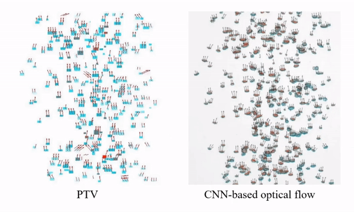
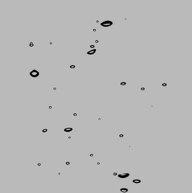
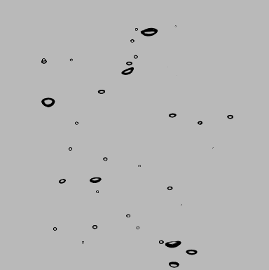
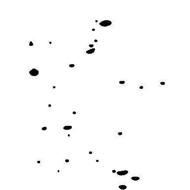
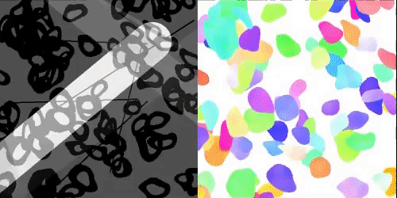

# DeepBubbleVelocimetry for evaluating the bubble velocity field 

This is a project of [Multiphase flow & Flow visualization Lab](https://mffv.snu.ac.kr/). The purpose of the project is to obtain the bubble velocity field from experimental images using CNN-based optical flow model. More information can be found in the paper ([Choi et al. 2022](https://doi.org/10.1038/s41598-022-16145-y)). 

The codes are based on [PWC_Net (Sun et al. 2018)](https://github.com/NVlabs/PWC-Net) with the pre-trained weights. The tensorflow version can be found [here](https://github.com/philferriere/tfoptflow).

The output of the model is as follows:

- velocity field (two dimensional array in techplot format, or it can be read through wordpad or text in Window OS)
- velocity field contour (png)

The repository includes:

- Source code of implementation of PWC-Net based on the finetuned weights.
- Source code to generate the velocity field (techplot file) and its contour (png).

The examples of the result is shown below:
- Application for bubble plume with various void fractions


- Comparison with the PTV and CNN-based optical flow for dense bubble plume


- Effect of the training (it is seen that the horizontal vectors from the weakly trained model are inaccurate)


## Tested environment
This code was tested on the below environment.

- NVIDIA RTX 2080 ti
- Driver 440.95.01
- CUDA 10.2
- cuDNN 7.6.5
- Python 3.7
- TensorFlow 1.14.0
- Keras 2.2.5 and other common packages listed in `requirements.txt`.


## Preparing the input
Prepare two consecutive bubble images (format of JPG or PNG or TIF) and one mask image.
- For example, Img_0001.png, Img_0002.png, and msk_0001.png 
- (Here, the square size is recommended, e.g., 300 x 300 pixels)






## How to test your own bubble image/video
1. Clone this repository
1. Install dependencies
   ```bash
   pip3 install -r requirements.txt
   ```
1. Download trained weights from this [link](https://drive.google.com/file/d/1WTe6k3u0NsHwSko8sqna02gP3pJS6R5d/view?usp=sharing).

1. Run prediction script (CNN_OpticalFlow.ipynb) **in `Code/` directory** to obtain the velocity field (supports only 3-channel jpg image).


## Generating the synthetic bubble images
- Code is attached in the "SyntheticBubbleImage" folder.
- The density, velocity, magnitude of deformation (or the light noise) can be controlled using code.
- Output of the code is as follows: Two consecutive bubble images and one flow file (visualized by color contour).



Any comments/questions are welcome.
Please contact to dae416@snu.ac.kr
